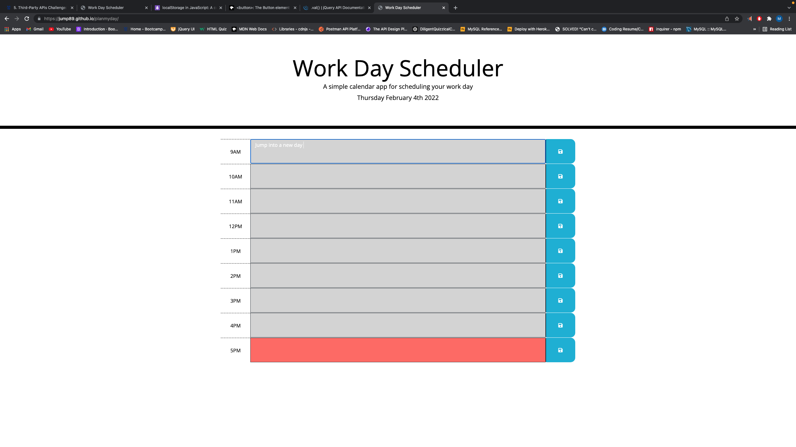

## planmyday

Daily Planner 

## Description 

* This application was created to make a daily planner with a few features  . 

## User Story 

## Features

* Enter text in textarea
* Save textarea content to local storage
* Time blocks change color to show past , present , future time
* Displays Current Date 

## Installation

* The app can be excessed through the web browser at []{}

## Dependencies

* No dependencies for this Application 

## License

* No License for this Application 

## Contributing 

* No contribution information for this Application 

## Credits 

* [Marcio Ramos]{https://github.com/Jump89}

## Resources 

 * Local Storage

## Front End

* HTML
* CSS
* Bootstrap 5.0
* [Moment.js]{https://momentjs.com/}

## Backend

* No backend technologies for this Application 

## Repo

* (https://github.com/Jump89/planmyday)

## Website

* (https://jump89.github.io/planmyday/)

## Landing Page Screen Shoot

* 
* 